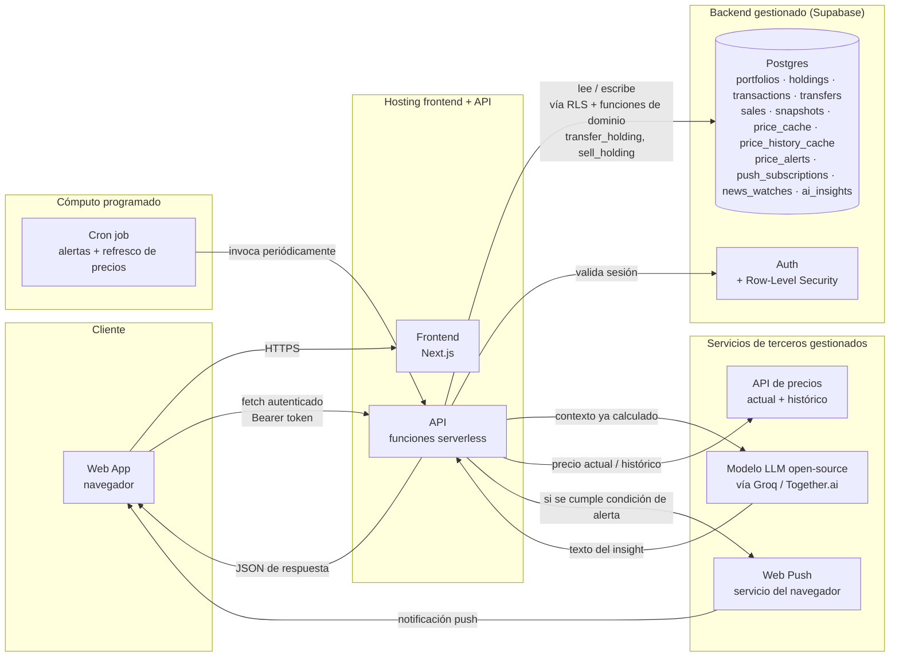

# Definición de Arquitectura — StonksView

TPI Desarrollo de Software Cloud (UTN FRLP, 2026)

Esta es la arquitectura de todo el proyecto, no un recorte para una entrega puntual — es literalmente la base sobre la que se construye StonksView, apoyada en el esquema de datos ya existente de Mía.

---

## 1. Diagrama de arquitectura

## 2. Decisiones de arquitectura

- **Multi-portfolio por usuario:** cada holding, transacción, transferencia, venta y snapshot cuelga de un `portfolio_id`, no directo de `user_id` — un usuario puede tener más de una cartera (ej. una personal y otra para un fondo familiar). La seguridad se resuelve verificando que el portfolio le pertenece al usuario autenticado, no comparando `user_id` directo en cada tabla de dominio.
- **Lógica de dominio en funciones de Postgres, no en el backend:** operaciones que tienen que ser atómicas y consistentes — transferir una tenencia entre sedes preservando costo base, o vender con cálculo de ganancia realizada FIFO/LIFO — viven como funciones en la base (`transfer_holding`, `sell_holding`) que el backend invoca vía RPC. Si esa lógica viviera en una función serverless que lee, calcula y escribe en pasos separados, dos requests simultáneos sobre el mismo holding podrían pisarse; adentro de una función de Postgres, la transacción de la base lo evita.
- **Prisma solo para schema y migraciones, nunca para queries en runtime:** las queries de la app pasan por el cliente de Supabase con el token del usuario, que es lo que hace que RLS se aplique automáticamente. Una conexión directa de Prisma con el `DATABASE_URL` no lleva ese contexto de sesión y podría bypassear RLS si se la usara para leer o escribir en producción — por eso Prisma queda limitado a generar tipos y versionar el schema.
- **Proceso programado, no contenedor persistente:** las alertas de precio y el refresco de `price_cache`/`price_history_cache` necesitan un chequeo periódico. Eso no exige un servidor corriendo 24/7 — se resuelve con un **cron job** que invoca una función serverless cada cierto tiempo; el resto del backend sigue siendo serverless puro, sin nada esperando eventos entre un request y el siguiente.
- **La IA nunca calcula, solo interpreta:** el LLM recibe como contexto las métricas que ya calculó el backend (patrimonio por sede, ganancia no realizada, concentración de riesgo) y devuelve texto — nunca un número nuevo. Evita que una alucinación del modelo se disfrace de dato financiero.
- **Sin base vectorial:** una base vectorial está pensada para búsqueda por similitud semántica sobre contenido no estructurado — texto, documentos, embeddings de imágenes — donde la pregunta es "¿qué se parece a esto?". El dominio de StonksView es lo opuesto: datos numéricos estructurados donde la pregunta es "¿cuánto sumo, exactamente?" (patrimonio total, ganancia no realizada, composición por sede). Convertir esos números en un embedding para buscar "similitud" no tiene sentido — se pierde precisión y no hay forma de garantizar una suma exacta desde un resultado de similitud. Una base relacional con `SUM`/`GROUP BY` resuelve esto de forma exacta y determinística, que es justo lo que hace falta antes de mandarle el resumen al LLM.
- **Degradación elegante como requisito:** si la API del LLM no responde, el endpoint de insight devuelve un estado explícito ("no disponible") sin romper el resto del dashboard, que es 100% determinístico.

## 3. Flujos principales

### 3.1 Generar un insight

1. El usuario abre el dashboard → el frontend pide su resumen de cartera a la API con su token de sesión.
2. La función de backend valida la sesión, consulta las tenencias del portfolio (con RLS aplicado automáticamente), y calcula patrimonio total, composición por sede y por clase de activo.
3. El usuario pide un insight → el backend arma un prompt con esas métricas ya calculadas (sin datos personales identificables, solo montos y símbolos) y llama al modelo con un timeout corto.
4. Si responde a tiempo: se guarda el insight en `ai_insights` (auditable) y se devuelve al frontend. Si no responde o excede el límite diario del usuario: se devuelve un estado de "no disponible" sin romper el resto del dashboard.

### 3.2 Transferencia interna

1. El usuario mueve un activo de una sede propia a otra.
2. La API valida sesión y verifica que el holding de origen pertenece a un portfolio del usuario.
3. Invoca `transfer_holding` vía RPC con el holding de origen, la sede destino y la cantidad.
4. La función actualiza o crea el holding destino preservando costo base y fecha de adquisición, y registra la fila en `transfers`.

### 3.3 Venta (operación de mercado real)

1. El usuario vende una tenencia, indicando método FIFO o LIFO.
2. La API invoca `sell_holding` vía RPC.
3. La función consume los lotes correspondientes, calcula `proceeds`, `cost_basis` y `realized_gain`, guarda el detalle de qué lotes se consumieron en `lots_consumed` (jsonb) y crea la fila en `sales`.

### 3.4 Chequeo de alertas (proceso programado)

1. El cron job invoca la función de chequeo periódicamente.
2. La función trae las alertas con `active = true`, junto con el precio cacheado de cada símbolo (o lo refresca si venció).
3. Por cada alerta, evalúa la condición (`above`/`below` contra `target_price`, o variación porcentual contra `base_price`).
4. Si se cumple: busca las suscripciones push del usuario y envía la notificación; marca `triggered_at`. Si no hay suscripción activa o el envío falla, no rompe el resto del chequeo — sigue con la próxima alerta.

## 4. Requisitos no funcionales clave

| Dimensión | Requisito |
|---|---|
| Seguridad de datos | Row-Level Security por portfolio; secretos de servidor (incluida `DATABASE_URL` de Prisma) nunca en variables públicas del frontend. |
| Costo | Rate limit por usuario/día en el endpoint de IA; el cron corre periódicamente con costo marginal — no hay contenedor pagando cómputo ocioso entre corridas. |
| Resiliencia | Timeout corto + circuit breaker en la llamada al LLM; el resto del producto no depende de esa disponibilidad. El chequeo de alertas es idempotente: una corrida fallida no duplica notificaciones, se re-evalúa en la siguiente. |
| Observabilidad mínima | Endpoint de `/health` verificado post-deploy; log de qué contexto se envió a la IA, para poder auditar. |

---

## 5. Stack tecnológico

| Capa | Tecnología | Razón de uso |
|---|---|---|
| Frontend / hosting | Next.js + Vercel | Deploy en minutos, preview automático por cada PR, API routes integradas sin infraestructura separada. |
| Backend / API | API routes de Next.js (serverless en Vercel) | Cero infraestructura separada; alcanza sobrado para un backend sin proceso persistente. |
| Persistencia + autenticación | Supabase (Postgres + Auth + RLS) | Datos e identidad en un solo proveedor; RLS resuelve de forma nativa el requisito de seguridad más importante del dominio. |
| ORM / migraciones | Prisma (solo schema y migraciones, nunca queries en runtime) | Tipado de los modelos y control de versiones del schema, sin arriesgar el bypass de RLS que implicaría usarlo para leer/escribir en producción. |
| Scheduler | Vercel Cron Jobs | Mismo deploy, sin infraestructura nueva — invoca una API route existente. (El plan Hobby limita a una corrida por día; para chequeos más frecuentes hace falta plan Pro o un cron externo.) |
| Notificaciones | Web Push (`web-push`, VAPID keys) | Estándar del navegador, sin servicio de notificaciones separado para este volumen. |
| IA | Modelo open-source autohospedado (Llama, servido vía Groq o Together.ai) | Sin costo por token de un proveedor cerrado y control total sobre qué modelo corre; el equipo demuestra manejo de despliegue de modelos propios, no solo consumo de una API paga. |
